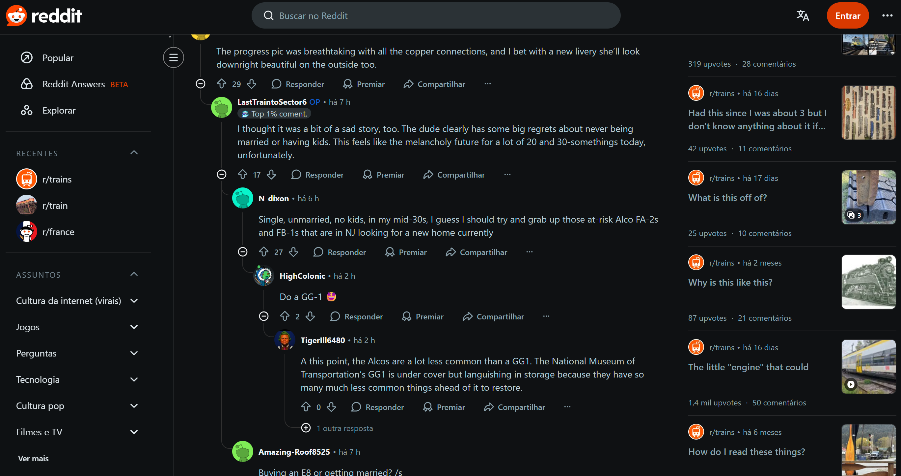
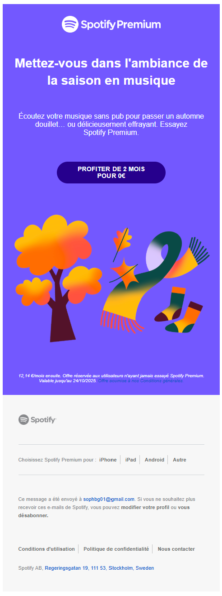

+++ 
date = 2025-09-18
title = "Affordances, Gestalt Laws and Dark Design Patterns in Daily Life"
description = "Homework 1"
slug = ""
authors = ["Sophia"]
tags = ["Lecture 1", "Lecture 2", "Lecture 3"]
categories = ["Lecture", "HW1"]
externalLink = ""
series = []
+++

---
# Affordances

In this post, I document examples of good and bad affordances that appear in daily life and explain how design decisions can affect usability.

## Good Affordance

The handle of a mug is a great example of an effective affordance.
Its curved shape naturally invites the user to grasp or hold it. Even without instructions, you immediately understand how to interact with it.

  

This is a good affordance because the physical form clearly communicates the intended action.
The design itself guides behavior, you don't need to think or read instructions. The interaction feels intuitive.

## Bad Affordance

A classic example of poor affordance is a door with a vertical bar handle on the push side.
The handle visually suggests pulling, but the correct action is to push. This mismatch between appearance and function leads to confusion and hesitation.

  

This is a bad affordance because the perceived affordance (what the user thinks they can do) doesn't match the actual affordance (what the designer intended).
To fix this, the vertical handle could be replaced with a flat plate, signaling "push here" rather than "pull me."

---
# Gestalt Laws

Below are two examples of Gestalt principles that are poorly applied in digital environments, leading to confusion and reduced usability.

# News Website - Le Parisien

  

On the homepage of Le Parisien, several Gestalt principles are violated:

Law of Proximity: Text blocks, headlines, and links are placed too close together, making it difficult to see which elements belong together.

Law of Similarity: Advertisements and news content share similar colors and fonts, confusing users about what is editorial content and what is a paid ad.

How to fix it: Add more spacing between news sections, use consistent alignment, and visually differentiate ads. For example, with background shading or clear "Advertisement" labels.

# Reddit Comment Section

  

In Reddit's comment interface, the Law of Continuity and Law of Proximity are partially violated.
Thin vertical lines and inconsistent indentation make it hard to follow which reply belongs to which parent comment, especially in long threads.

How to fix it: Increase indentation for each reply level, use alternating background colors, or add clearer separators between comment groups.
This would improve readability and make the hierarchy more visually intuitive.

---
# Dark Design Patterns

Dark patterns are interface tricks that manipulate user behavior.
Below are two examples and suggestions for ethical redesigns.

# Interface Interference - Spotify Email Design

  

What it is: It’s very easy to click on the main action the company wants, but much harder to find or perform the opposite action. The interface visually guides the user in one direction.

Example in daily life: The "Spotify Premium" promotional email shows a big and colorful button inviting you to try Premium for 2 months for free, but the link to stop receiving this type of advertisement email is very small, grey, and hidden at the bottom of the message.

How to redesign: Keep the promotional button visible, but also make the unsubscribe option more accessible. For example, a clear "Unsubscribe from promotional emails" link in readable size and color.

# Nagging - Duolingo Notifications

  

What it is: The interface uses guilt or emotional pressure to drive engagement.
For instance, Duolingo shows a sad owl when you miss a lesson or a countdown timer as the day ends, creating anxiety and guilt.

How to redesign ethically: Use neutral messages that respect the user's autonomy.
Instead of emotional manipulation, show objective statistics (e.g., learning progress or streak consistency) to motivate users positively.

---

These examples highlight how thoughtful design, or its absence, affects everyday interactions.
Good affordances and clear visual organization make experiences intuitive, while manipulative or inconsistent patterns harm trust and usability.