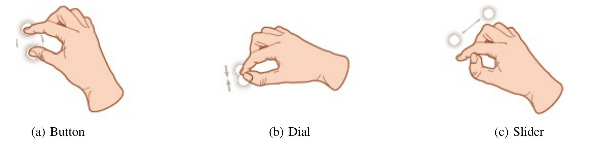

+++ 
date = 2025-09-25T22:09:57+01:00
title = "HCI ideas over the time"
description = "Homework 2"
slug = ""
authors = ["Sophia"]
tags = ["Lecture 4", "Lecture 5", "Lecture 6"]
categories = ["Lecture", "HW2"]
externalLink = ""
series = []
+++

---
# HCI Researcher: Jacob O. Wobbrock

For this topic, I explored the work of Jacob O. Wobbrock, a leading researcher in Human Computer Interaction and a professor at the University of Washington. What makes Wobbrock's work stand out is his long term dedication to understanding how people interact with computers in the real world, especially people with diverse abilities.

  

His research consistently asks a simple but fundamental question: What if technology adapted to us instead of forcing us to adapt to it?

A large part of his work revolves around accessibility and input techniques. He develops systems that measure human performance, model input behavior, and design new ways of interacting with digital systems. Wobbrock is also one of the central voices behind Ability Based Design, a framework arguing that interfaces should adjust dynamically to users' individual capabilities. This approach goes beyond merely "supporting" accessibility, its goal is to build inherently flexible technologies.

Currently, Wobbrock co-directs the CREATE Center, which aims to advance accessible technology through research ranging from mobile interaction to AI driven sensing. Many of his ongoing projects focus on designing input techniques for users with motor impairments and building toolkits that let mobile devices adapt automatically to each user's motor abilities.

What I find most interesting is how his work blends rigorous measurement with a deep understanding of human variability. It's a perspective that feels particularly relevant today, where personalization, sensing, and adaptive systems are becoming the norm in modern HCI.

---
# "The Ultimate Display" (Ivan E. Sutherland)

Reading Ivan Sutherland's The Ultimate Display is like opening a time capsule from the 1960s that somehow describes the future we live in. In this short but visionary text, Sutherland imagines a world in which computers can create environments so immersive that digital objects feel physically real. A chair in such a display could be sat on, a bullet could be fatal.

  

While this sounds dramatic, the core idea is about complete immersion, a blending of physical and digital worlds.

What surprised me is how much of Sutherland's vision is already alive today. VR headsets, AR glasses, haptics, gesture tracking, even eye-tracking interfaces, they're all predicted in this essay. He talks about computers that can sense our muscles, interpret our movements, and respond to our bodies in real time. It's exactly what modern interaction technologies are trying to do.

But some of his ideas remain far in the future. We still don't have virtual matter you can fully rely on, rooms where physics is simulated through force fields, or environments that completely override reality. The tactile illusion still has huge limitations, our senses constantly remind us we're not really inside a virtual world.

Yet the fact that Sutherland could imagine all this in 1965 is astonishing. Reading the text feels less like reading a prediction and more like reading a roadmap, one that researchers are still following today.

---
# Input Devices and Interaction Paradigms

For this post, I looked at an input technique that appeared in research with a lot of excitement but never really became mainstream: micro-gesture interaction using 3D holoscopic cameras.

The idea was compelling. Instead of large hand movements or full arm gestures (which are tiring and impractical), users could perform tiny finger motions that a special 3D camera would detect. It promised subtle, discreet, and natural interaction, especially for wearables or AR glasses.

  

In theory, it had everything: novelty, elegance, and technical sophistication.

But in practice, it struggled. The hardware was too complex and expensive, the sensing wasn't reliable outside controlled environments, and simpler alternatives, like touch, voice, or small Bluetooth clickers, completely overshadowed it. Micro-gestures also suffered from discoverability issues: users didn't always remember what gesture triggered what command.

  

Despite these challenges, I don't think the idea is dead. With smaller sensors, better AI based recognition, and revived interest in AR/VR, micro-gesture input might still find its place. The intuition behind it, that interaction should feel effortless and adapt to our bodies, fits perfectly with the direction HCI is heading.

In a way, it connects back to the themes from Wobbrock and Sutherland: sensing, embodiment, and blending the physical with the digital. Many of these "failed" techniques aren't failures, they're ideas waiting for the right technological moment.