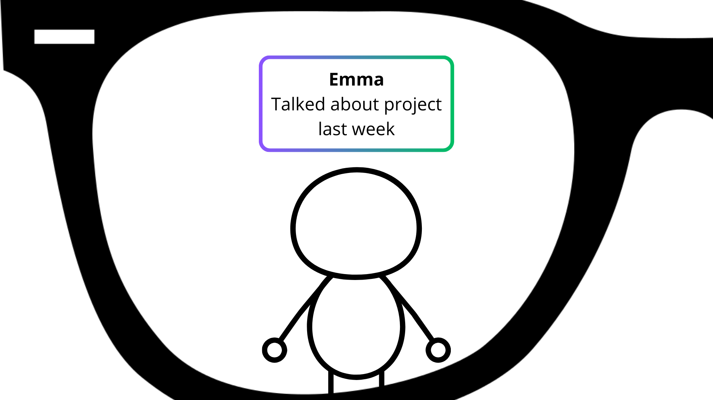
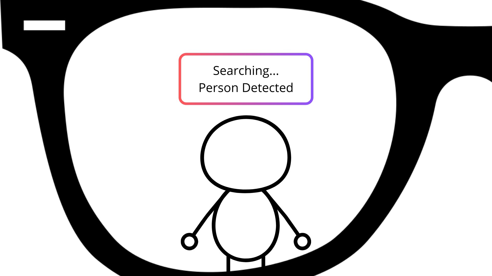
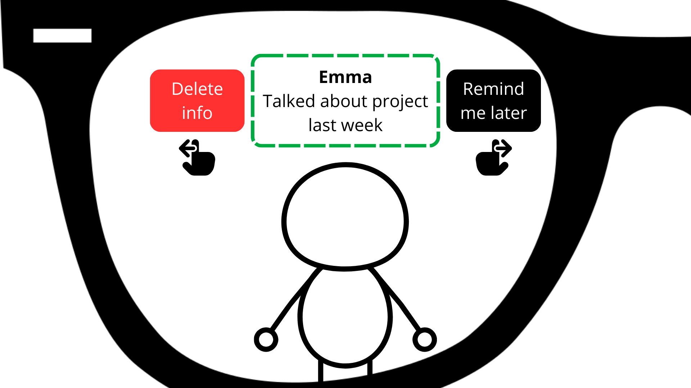

+++ 
date = 2025-10-02
title = "Ideation and prototyping of AR"
description = "Homework 3"
slug = ""
authors = ["Sophia"]
tags = ["Lecture 7", "Lecture 8", "Lecture 9"]
categories = ["Lecture", "HW3"]
externalLink = ""
series = []
+++

---
# Ideation

For this post, I explored how augmented reality could enhance human abilities in everyday scenarios.  
To do this, I generated three distinct concept sketches, each representing a different form of augmentation: memory, physical skills, and emotional awareness.

## 1. AR Memory Assistant

This concept overlays contextual information about the people we meet.  
It aims to support social memory, helping users recall names and past conversations.

  

## 2. AR Skill Coach (Tennis)

This idea focuses on motor-skill augmentation.  
Through AR trajectory overlays, the system guides users toward more accurate physical movements, in this sketch, a tennis swing.

  

## 3. Emotional Insight AR

This concept augments emotional perception, helping users understand social cues by displaying subtle indicators of others' emotional states.

  

---
# Prototype

For the prototyping phase, I selected the **AR Memory Assistant** as the concept to develop into a low-fidelity paper prototype.  
My goal was to simulate the interaction flow: detecting a person, retrieving information, and presenting contextual memory cues.

Below is the step-by-step representation of the prototype screens, as seen through stylized AR glasses.

## Prototype Step 1 - Neutral Scene

The system has not yet detected the person.  
This establishes the baseline, showing what the user sees before augmentation begins.

  

## Prototype Step 2 - Person Detected

The AR system identifies a person in the user's field of view.  
A detection frame and status message appear.

  

## Prototype Step 3 - Name Recognition

Once the system recognizes the individual, their name is displayed.

  

## Prototype Step 4 - Contextual Memory

Additional contextual information appears, such as the topic of the last conversation.  
This is the core of the "memory assistant" idea.

  

## Prototype Step 5 - User Options

To simulate interaction, I added simple AR options:  
**Delete info** or **Remind me later**, represented as gestures.

  

---
# Evaluation

To evaluate the prototype, I asked one participant to interact with the paper simulation.  
This person was a classmate familiar withiout AR knowledge.  
The test consisted of showing each prototype stage and observing their reactions as they "experienced" the flow.

Below is a summary of their feedback and my reflections.

## User's First Impression

The participant immediately understood the sequence of the prototype:

> "It makes sense. Seeing nothing at first, then detection, then the name, then the info, it's very clear."

She felt that the order of interaction was natural and easy to follow.

## Perceived Usefulness

The participant saw strong potential in real-life situations:

> "I would definitely use something like this at university or work. I forget names all the time."

She considered it socially helpful and even stress-reducing.

## Visual Clarity

While they appreciated the use of color coding and frames, she noted:

> "Maybe showing both the name and the extra info at the same time is too much. It could appear step by step."

This highlighted a mild **information overload**, suggesting a more progressive reveal.

## Privacy Concerns

This was the participant's strongest concern:

> "Wouldn't people find it creepy? How does it know my last conversation? Does it record everything?"

They questioned how the system gathers data and whether individuals would consent to being recognized.

This indicates that **privacy and transparency** must be core design considerations.

## Reaction to Interaction Buttons

Regarding the "Delete info" and "Remind me later" options:

> "It's useful, but maybe too heavy visually. Icons or gestures might look more natural."

The participant preferred **minimalist controls**, ideally gesture-based rather than large buttons.

## Suggestions from the User

They also recommended:

- Allowing the user to choose when the AR activation happens.  
- Using softer colors to avoid a "sci-fi" aesthetic.  
- Having a "minimal mode" that only displays the person's name.

---
# Critical Reflection

The user test revealed that the **core concept is clear, functional, and genuinely useful**, especially for memory support in social or professional settings.

However, two major themes emerged:

### 1. **Information management:**  
Presenting all information at once can overwhelm the user.  
Future designs should adopt a **layered disclosure** approach: first name, then optional details.

### 2. **Ethical and privacy concerns:**  
Any real implementation must clearly communicate:  
- What data is collected  
- How it is stored  
- Whether users can opt out  
- When recognition is active

This tension between *utility* and *privacy* is central to human augmentation technologies and shapes future design directions.

---
# Final Thoughts

The prototype and evaluation provided valuable insights into how AR can meaningfully support human cognition, but also reminded me that technological augmentation must remain socially acceptable and ethically grounded.

This iterative process, from ideation to evaluation, helped refine not only the interface but the **responsible design considerations** needed for real world deployment.