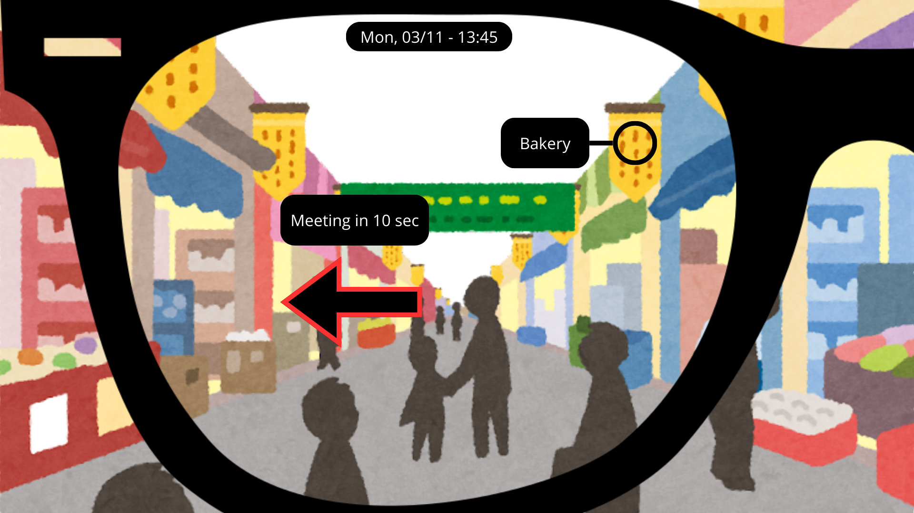
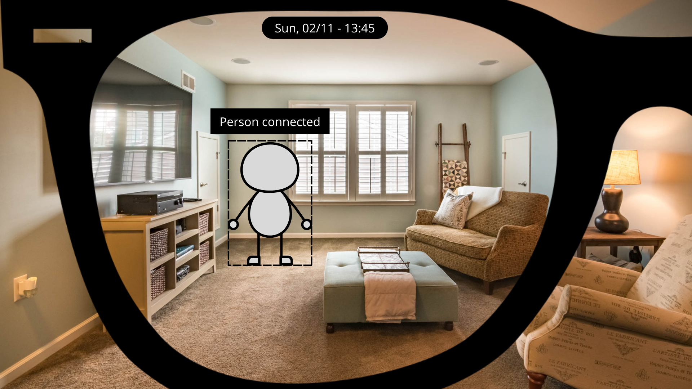

+++ 
date = 2025-11-15T22:10:05+01:00
title = "The Evolving Shape of Technology"
description = "Homework 4"
slug = ""
authors = ["Sophia"]
tags = ["Lecture 10", "Lecture 11", "Lecture 12"]
categories = ["Lecture", "HW4"]
externalLink = ""
series = []
+++

---
# The Shape of Smartphones

Smartphones didn't always look like the sleek rectangles we carry today. In the early days, mobile phones came in every shape imaginable: bricks, flips, sliders. Function dictated form. But once touchscreens took over, the industry converged into one shape: a thin rectangle designed to maximize usable screen area.

  

Over the years, this shape has barely changed. Instead, the innovation shifted toward what the shape can do: bend, fold, or stretch. Foldable devices try to solve a simple problem: we want bigger screens without carrying bigger objects. Rollable prototypes push this further by letting the device physically adapt to what we're doing.

The next transformation might break the idea of "phone shape" entirely. We may move toward devices that are:

- Flexible or wearable, conforming to the body.
- Spatial or holographic, where the interface is projected into the environment and no longer tied to a slab of glass.
- Context-aware, changing shape or interface depending on the task.

If the future of interaction becomes spatial, the smartphone may evolve into something less like an object and more like a companion, present, adaptive, and invisible.

---
# The Computer for the 21st Century

In 1991, Mark Weiser imagined a world of ubiquitous computing, technology woven into daily life so seamlessly that it becomes invisible. He described calm technology: tools that help us without demanding attention.

  

Today, we're undeniably closer to that world:

- Smart speakers, watches, thermostats, lights, everything is connected.
- Cloud services let us access information anywhere.
- AI assistants increasingly understand context and intention.
- Sensors in wearables quietly track our health and habits.

But we're not quite there yet.

Our devices still compete for attention. Ecosystems don't fully work together. And privacy concerns make people hesitant to embrace fully ambient systems.

To reach true ubiquitous computing, we'll need:

- Interoperability between devices and platforms.
- Invisible interfaces that surface information only when needed.
- Trustworthy, privacy-preserving intelligence built into our environments.

Weiser's vision is no longer science fiction. We're living the early chapters, but the seamless future he imagined still requires work.

---
# Most downloaded application in the Future MR app store

Let's imagine a world where MR headsets are as widespread as smartphones. They're light, affordable, stylish, and socially acceptable. In this world, what becomes the "most downloaded app"?

Probably not a single "killer app", but a set of everyday tools that redefine how we live, work, and play. Here are three likely candidates:

## 1. MR Life Overlay

A universal, always-on digital layer that displays navigation, reminders, real-time translations, and contextual info directly in your environment.
It's like having Google Maps, Apple Vision Pro's interface, and a personal assistant fused together.

  

**Why it would be downloaded:** It helps with every daily task: productivity, commuting, learning, remembering.

## 2. Social Presence+

A shared MR environment where friends, family, or coworkers appear as photorealistic avatars in your physical space. Meetings, hangouts, study sessions, all blended with reality.

  

**Why it would be downloaded:** Humans will always crave connection, and MR makes connection spatial again.

## 3. MR Creator Studio

A tool to redesign your surroundings with virtual objects: art, furniture, lighting, widgets, floating dashboards, or creative AR effects.

  

**Why it would be downloaded:** Personalization is the heartbeat of modern apps, and MR amplifies it into the entire room.

---
# Final Thoughts

Across this post, one pattern becomes clear: technology keeps moving closer to our lives, physically, socially, and spatially.

Phones became extensions of our hands.
Ubiquitous computing blends into our environment.
MR promises interfaces that surround us rather than reside inside a frame.

We’re heading toward a future where computing has no fixed shape, because the "device" becomes everywhere.