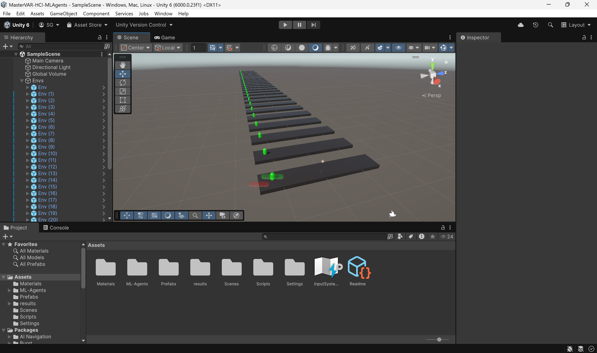

+++ 
date = 2025-10-16
title = "Training a Unity Agent using ML-Agents"
description = "Lab Unity ML-Agents"
slug = ""
authors = ["Sophia"]
tags = ["ML-Agents", "Unity"]
categories = ["Lab"]
externalLink = ""
series = []
+++

---
# Overview

In this project, I created a simple Unity game environment where a character must jump over incoming obstacles generated at random intervals.
The core mechanics are very similar to endless-runner games: the player can jump, obstacles move toward them, and the goal is to avoid collisions.

For this version, the character is controlled entirely by reinforcement learning using **Unity ML-Agents**.

---
# ML-Agent Setup

I used the **PPO (Proximal Policy Optimization)** trainer with **default ML-Agents hyperparameters**, except for the training duration.  
The model has currently been trained for: 87.130.390 epochs

I accelerated the learning using **32 parallel environment copies**, significantly reducing total training time.

<div align="center">  </div>

The full `trainer_config.yaml` used:

```yaml
default_settings: null
behaviors:
  MLPlayer:
    trainer_type: ppo
    hyperparameters:
      batch_size: 1024
      buffer_size: 10240
      learning_rate: 0.0003
      beta: 0.005
      epsilon: 0.2
      lambd: 0.95
      num_epoch: 3
      shared_critic: false
      learning_rate_schedule: linear
      beta_schedule: linear
      epsilon_schedule: linear
    checkpoint_interval: 500000
    network_settings:
      normalize: false
      hidden_units: 128
      num_layers: 2
      vis_encode_type: simple
      memory: null
      goal_conditioning_type: hyper
      deterministic: false
    reward_signals:
      extrinsic:
        gamma: 0.99
        strength: 1.0
        network_settings:
          normalize: false
          hidden_units: 128
          num_layers: 2
          vis_encode_type: simple
          memory: null
          goal_conditioning_type: hyper
          deterministic: false
    init_path: null
    keep_checkpoints: 5
    even_checkpoints: false
    max_steps: 500000000
    time_horizon: 64
    summary_freq: 50000
    threaded: false
env_settings:
  num_envs: 1
engine_settings:
  time_scale: 20.0
  no_graphics: true
checkpoint_settings:
  run_id: ppo
  resume: true
```

---
# Perception System

The agent uses **Ray Perception Sensors** to detect:
- incoming obstacles
- the ground (floor)

These rays help the agent understand when to jump and how far an obstacle is.

<div align="center">  </div>

---
# Reward Structure

To guide learning, I used a simple reward system:

| Action / Event                 | Reward    |
| ------------------------------ | --------- |
| Successfully avoiding obstacle | **+0.1**  |
| Jumping (any time)             | **-0.01** |
| Collision with obstacle        | **-1.0**  |

This encourages *useful jumps* while preventing random spamming of the jump action.

---
# Result

Even after tens of millions of training steps, the agent is still **far from perfect**.  
It **misses many obstacles** and doesn't always time its jump correctly. However, it has learned an important behavior: **it only jumps when an obstacle approaches**, and it avoids jumping randomly.

This shows that the reward system successfully discouraged unnecessary jumps, even if the policy still needs more training to become reliable.

<div align="center">  </div>

The project can be found here:
https://github.com/SophBG/MasterVAR-HCI-MLAgents