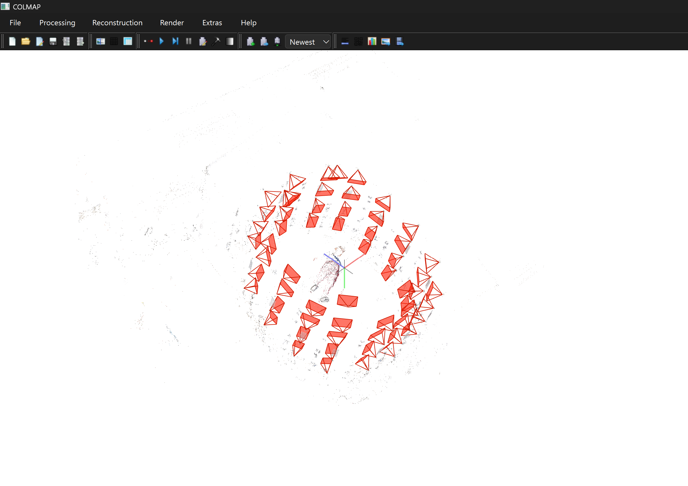
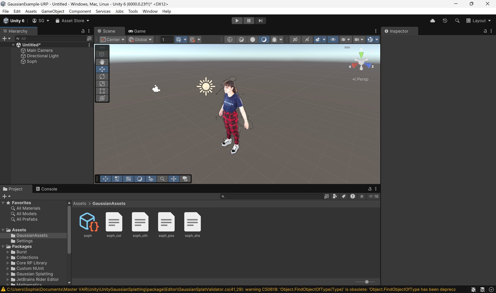

+++ 
date = 2025-09-18
title = "My Pipeline for Creating a Unity Renderer Using 3D Gaussian Splatting"
description = "Lab Unity Gaussian Splat"
slug = ""
authors = ["Sophia"]
tags = ["Gaussian-Splatting", "Unity"]
categories = ["Lab"]
externalLink = ""
series = []
+++

---
# Introduction

In this lab, I implemented a full **3D Gaussian Splatting** pipeline and imported the resulting model into **Unity** for real-time rendering.  
Gaussian splats have become a powerful alternative to mesh-based rendering, enabling high-quality neural radiance fields using millions of anisotropic Gaussians instead of polygons.

This post documents the entire workflow I used, from data capture to reconstruction to the final Unity renderer.

---
# Image Acquisition Setup

All images used to generate the Gaussian splat were captured inside a **studio with multiple cameras positioned around a central target**.

The system was arranged in a 360° configuration, and **the photos, as well as the resulting 3D model, were created around me**.  
This produced highly consistent viewpoints and lighting, which is ideal for 3D reconstruction and splatting.

  

---
# Reconstruction Pipeline

My Gaussian Splatting pipeline follows four major steps:

### **1. COLMAP - Point Cloud**
I started with **COLMAP**, running it at the highest possible quality settings for:

- Feature extraction
- Feature matching
- Sparse reconstruction

This step generated the camera positions and point cloud necessary for the Gaussian splatting construction.

  

### **2. Brush - Gaussian Splatting**
After COLMAP, I processed the model with **Brush** (also at maximum quality).  
This step generated the gaussian splats and ply file.

  

### **3. Supersplat - Environment Cleanup**
Next, I used **Supersplat** to:

- Clean unwanted background geometry  
- Remove floating points
- Keep only the subject-centered reconstruction  

This step is crucial for preparing the final splat asset for rendering.

  

  

### **4. Preparing the Gaussian Splat for Unity**
To get the splat into Unity, I followed the workflow from the slides shared in the HCI course from the Master VAR (based on a public repository).  
The general steps included:

- Exporting the Gaussian parameters  
- Organizing them in the Unity-compatible format  
- Configuring the rendering resources  

---
# Rendering Gaussian Splats in Unity

For real-time visualization, I used a Unity project made for Gaussian Splat rendering.  
Following the setup:

1. Open this *https://github.com/aras-p/UnityGaussianSplatting* repository in Unity.  
2. Create an empty GameObject.
3. Add a **GaussianSplatAsset** via  
   `Tools > Gaussian Splats > Create GaussianSplatAsset`  
4. Add the component **GaussianSplatRenderer** to the same object.  
5. Assign the exported splat data.

Once configured, Unity loads and renders the full set of Gaussians, millions of them, in real time.

  

---
# Final Thoughts

This pipeline combines traditional multi-view geometry with modern neural rendering methods.  
The combination of COLMAP, Brush, and Supersplat produces a clean and highly detailed reconstruction, and Unity provides an excellent playground for real-time visualization.

Working with data captured in a multi-camera studio, especially one built around a human subject, makes the result even more compelling, as the splat truly represents a volumetric snapshot of a real person.
