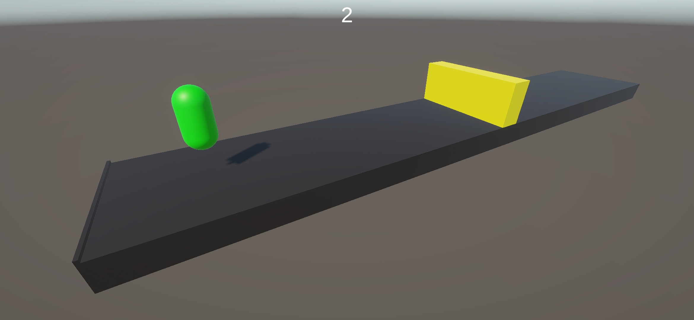

+++ 
date = 2025-10-30
title = "Building a Mobile Endless Runner in Unity"
description = "Lab Unity Mobile"
slug = ""
authors = ["Sophia"]
tags = ["Mobile", "Unity"]
categories = ["Lab"]
externalLink = ""
series = []
+++

---
# Overview

This project is based on the same core gameplay loop as my ML-Agents experiment:  
**a character that jumps to avoid randomly generated obstacles moving toward it.**

However, in this version, the goal was to build a **mobile-friendly game** with UI, menus, and touch controls.

---
# Core Gameplay

The player controls a character that can **jump with a single touch** on the screen.  
Obstacles spawn at random intervals and move toward the character.

A simple **score counter** increments each time the player successfully jumps over an obstacle.

---
# Game Over & Restart System

If the character collides with an obstacle, the game:

1. Displays a **Game Over** message  
2. Shows a UI panel with:  
   - **Restart button**  
   - **Return to Menu button**

This allows the player to retry quickly or go back to the main menu.

  

---
# Main Menu

The menu includes:

- **Start Game** button  
- **Quit Game** button

The UI was designed to be clean, minimal, and readable on small screens.

  

---
# Score System

Every time the player successfully avoids an obstacle, a counter increases.  
This is displayed on the top of the screen with a simple UI text element.

  

---
# Project Structure

- **Game Scene:** character, obstacle spawner, score and game over UI, floor
- **Menu Scene:** buttons for starting and closing the game  
- **Scripts:** game manager with UI and basic functions, main menu controller, obstacle spawner and movement, player movement and collision  

The logic is lightweight and optimized for mobile devices.

---
# Conclusion

This project transforms a simple jumping mechanic into a complete mobile application.  
With responsive touch controls, a clear UI flow, and a working game loop, it forms a solid foundation for future improvements such as animations, skins, or power-ups.

The project can be found here:
https://github.com/SophBG/MasterVAR-HCI-MobileGame